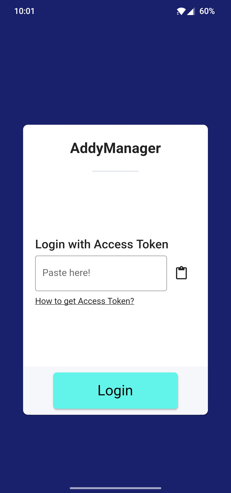

# Project title - Subtitle (3-5 words).
*A brief one-line two-sentence description of what this project does.*
Mobile app for [Google Images](https://google.com/images). This app utilises [Google Images' API](https://cloud.google.com/appengine/docs/standard/python/images) to search for images on the web.

*Badges go here. Make sure they're clickable and point to whatever service they represent.*

## Get it on
  

## Support PROJECT_NAME
Your support will help the continuous development of this project. Click on QR codes to get copy-able wallet address.

## Screenshots
*Three to five screenshots showcasing different screen and features. Gifs are a big plus.*
  

## Features
*Write about project's main features in list format. As always, keep it short and to the point. No tech talk, no jargon.
This list can be as long as you'd like but I'd keep it 10 items max. Long list but short list items.*
- Offline support for when you're on a plane.
- Dark theme.
- Quickly add and delete paragraphs.
- Advanced search capability. Search by name, email, or number.

### Upcoming Features
- Support for multiple accounts

## Security
*Write about how your project handles security. Again, no tech talk and point to external resource where needed.*
Security is very important to us. That's why we use on device encryption, iOS's [Keychain](https://developer.apple.com/documentation/security/keychain_services#//apple_ref/doc/uid/TP30000897-CH203-TP1), and Android's [KeyStore](https://developer.android.com/training/articles/keystore).

## Privacy
*Write about how your project cares about privacy. Ignore this section if you work for facebook, i mean meta.*
PROJECT_NAME is free and open source software licensed under [MIT](https://github.com/KhalidWar/readme_template_flutter/blob/master/LICENSE). Free as in free of charge, ads, analytics, and trackers. What's yours is yours.

## Packages and dependencies
*List out external dependencies used in this project. This section is optional but useful to link to external
packages you're always getting asked about. "Where did you get that beautiful bouncing animation?"*
- [HTTP](https://pub.dev/packages/http)
- [Flutter Riverpod](https://pub.dev/packages/flutter_riverpod)

## Development

### Contribution
*Instructions on how users/devs can contribute to your project*
You can contribute by reporting bugs, suggesting improvements, and/or by helping out with code.
1. Feel free to fork this repo and help out.
2. Make small, concise, and well documented commits.
3. No idea where to start? Contact me and I'll assign you appropriate tasks.

### Getting Started
Check out [Flutter's official guide](https://flutter.dev/docs/get-started/install) to installing and running Flutter on your system.

### Prerequisites
- Download IDE either [Android Studio](https://developer.android.com/studio) or [VSC](https://code.visualstudio.com/)
- Install Flutter SDK and Dart plugin.
- Flutter stable channel is used for development.
- Mobile device (emulator or physical).

### Steps
- Clone this repo to your local machine: `git clone https://github.com/KhalidWar/PROJECT_NAME.git`
- Run `flutter run pub get` in terminal inside project root directory.
- Run `main.dart` on emulator or physical device.
- All set!

---

#### License
*This section should consist of two sentences. First sentence declares the project's license and links to it.
Second sentence should briefly describe license's scope to a non-technical person*

This project is licensed under [MIT License](https://github.com/KhalidWar/readme_template_flutter/blob/master/LICENSE). It means you're free to use, copy, modify, merge, publish, distribute, sublicense, and/or sell this project's source code.

#### Acknowledgement and credit
*Here's where you publicly give credit to those who contributed to this project's existence*

Special thanks to the following amazing people:
- [KhalidWar](https://github.com/KhalidWar/) for providing this beautiful README template.
- 

#### Disclaimer
*Now, it's time to let everyone know it's not your fault if something goes wrong*

PROJECT_NAME is independently created by [Khalid War](KhalidWar) as a tool to help you search for images on Google and is not associated with the official [Google.com](https://google.com/) project or team.

[KhalidWar]: https://github.com/khalidwar